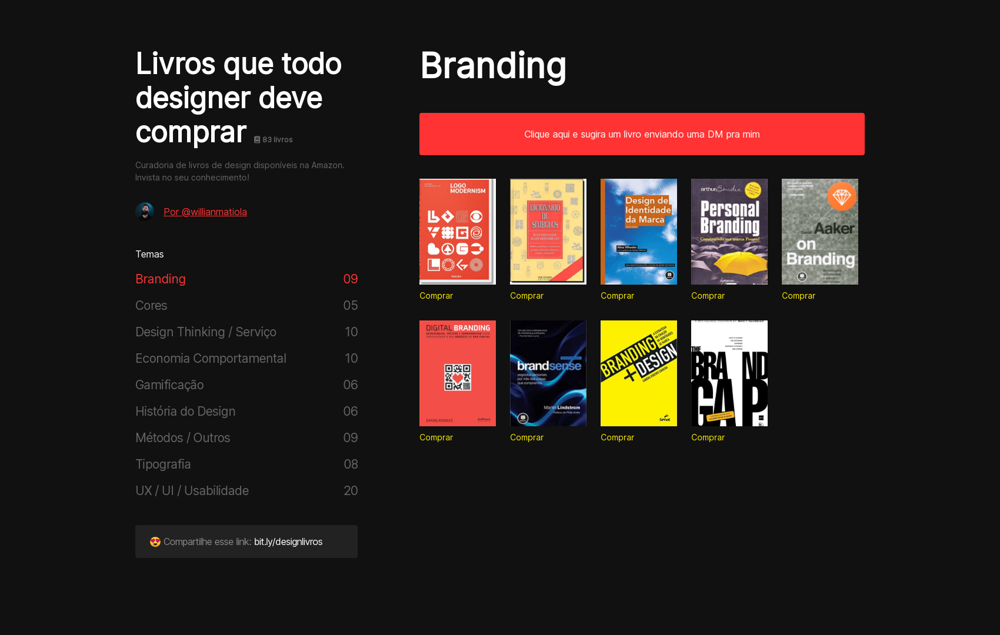

<br>
<div align="center">
    <h1>
        Design Books
    </h1>
    Design books you need to buy
</div>
<br>
<div align="center">

[](#about)
[](#getting-started)
[](#contribute)
<br>
[](#authors-and-collaborators)
[](#licence)

</div>
<br>

<br>

## About

Sharing design books with the community by categories. UI developed by [@williammatiola](https://github.com/willianmatiola).

## Getting Started

To optimizing and fast developing, the project use jekyll on github pages.

### Requeriments

- Ruby lang installed - For more info visit: [This link](https://www.ruby-lang.org/en/downloads/)

### Install

- Clone repo: `rpradosilva/designbooks`
- Run local server: `bundle exec jekyll serve`

## Contribute

1. [Create issue](https://github.com/rpradosilva/designbooks/issues/new/choose) with this structure:

```html
---
title: "<!-- My book title -->"
image: <!-- The image url of book -->
categories: [<!-- Category or Categories of book (Ex: Branding) -->]
buy: <!-- The url to buy book -->
---
```

2. **Wait for update** and close issue.

## Authors and Collaborators

|     [William Matiola](https://github.com/willianmatiola)     |      [Rafael Prado](http://www.github.com/rpradosilva)       |
| :----------------------------------------------------------: | :----------------------------------------------------------: |
|  |  |

## Licence

[Licença MIT](LICENSE)

---

### Developed by [](http://rprado.design)
